# TaskFlow – Approval & Task Management System

A React-based web application built to streamline how managers receive, review, and act on requests. Also offering a dedicated admin panel for assigning tasks and monitoring overall stats.

## Features

* 📥 Task inbox with filtering and sorting
* 📋 Detailed task view with context-aware action buttons
* ✅ Manage tasks with optional comments
* 🔔 Notifications page with detailed notifications
* 📊 Dashboard summary showing pending, completed, and overdue tasks
* 🛡️ Admin panel for assigning tasks and viewing overall stats

## Screenshots

<details>
<summary>Click to view all screenshots</summary>

### Inbox

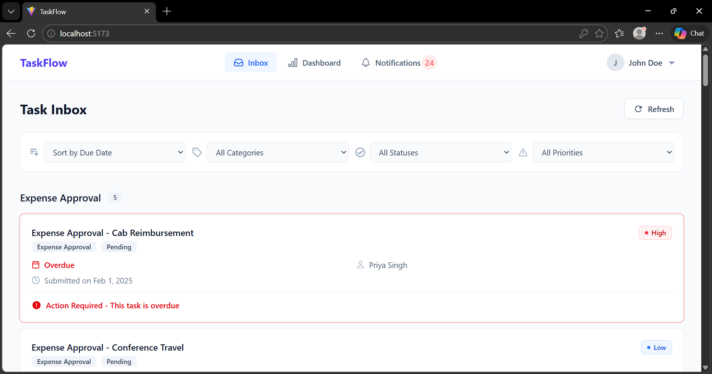

### Dashboards

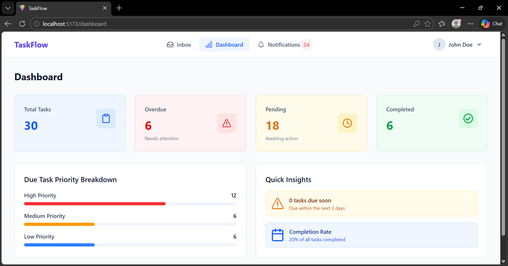
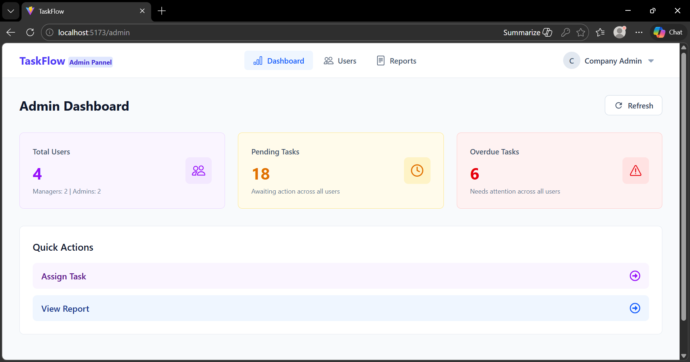

### Notifications

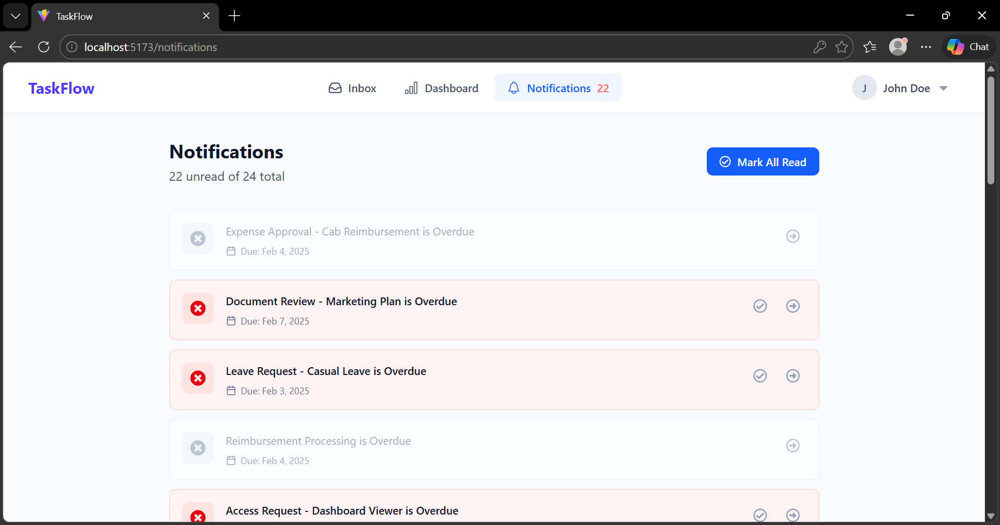

### Profiles

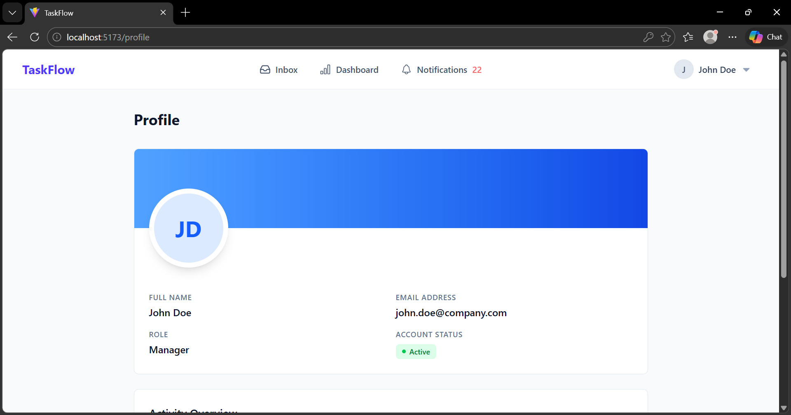

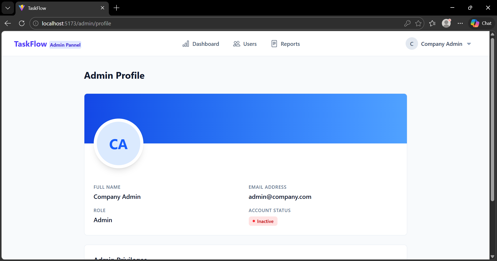

### Report

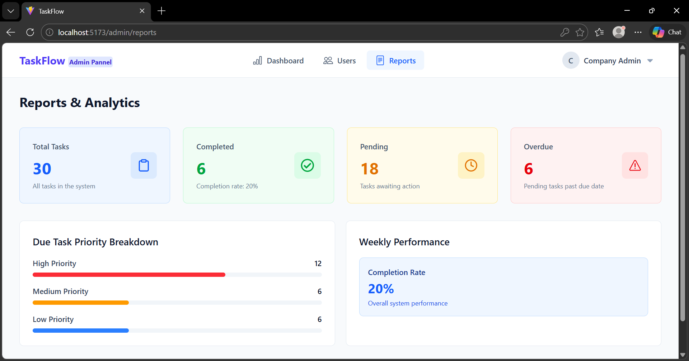

### Task Assign

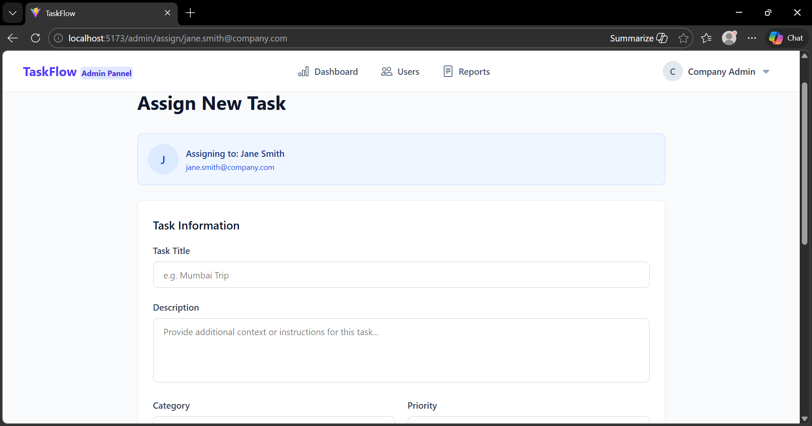

### Task Page

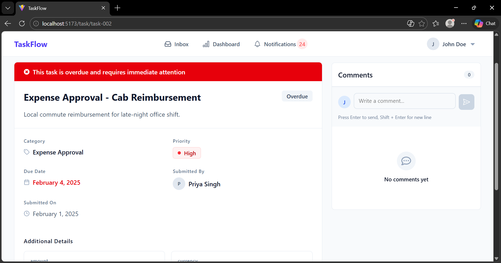

### Users

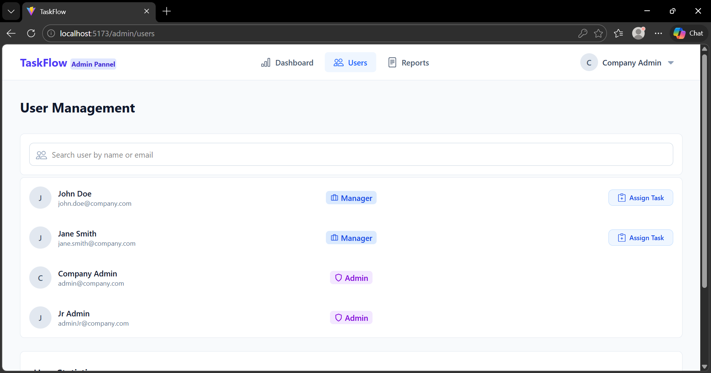

### User Add
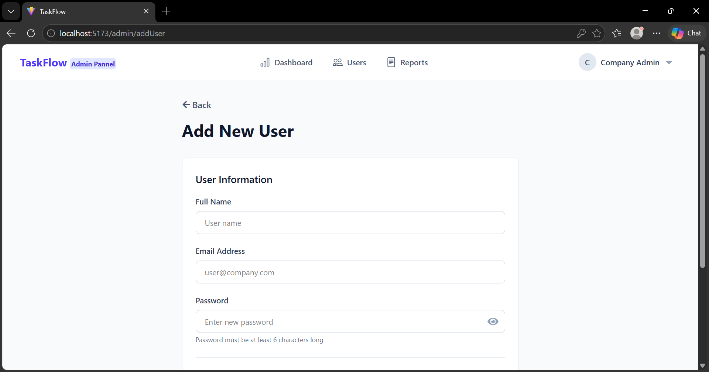
</details>

## Tech Stack

* **React (JavaScript)** – Component-based UI development
* **Vite** – Lightning-fast development server & bundler
* **React Router DOM** – Client-side routing
* **Tailwind CSS** – Utility-first styling
* **JSON Server** – Local mock backend & REST API
* **React Toastify** – Toast notifications
* **React Icons** – Icon library

## Installation

### Prerequisites

Make sure you have completed the [Vite – Environment Setup](https://vite.dev/guide/) instructions.

### Step 1: Clone the Repository

```bash
git clone https://github.com/Hardik0602/TaskFlow
cd TaskFlow
```

### Step 2: Install Dependencies

```bash
npm install
```

### Step 3: Start the Local Backend

```bash
npm run server
```

### Step 4: Start the Development Server

```bash
npm run dev
```

## Dependencies

```json
{
  "@tailwindcss/vite": "^4.1.18",
  "json-server": "^1.0.0-beta.5",
  "react": "^19.2.0",
  "react-dom": "^19.2.0",
  "react-icons": "^5.5.0",
  "react-router-dom": "^7.13.0",
  "react-toastify": "^11.0.5",
  "tailwindcss": "^4.1.18"
}
```

## Key Features Implementation

### Authentication

* Session persistence using local storage
* Protected routes redirecting unauthenticated users
* Log out with session clearance

### Task Inbox

* Filter by status and sort by due date or priority
* Responsive task list layout

### Task Detail & Actions

* Dynamic routes using task IDs
* Confirmation prompt before submitting any action
* Comments and action history

### Notifications

* Notification bell with live unread count
* Notifications list for new assignments, deadlines, and updates
* Mark individual or all notifications as read

### Dashboard & Admin

* Summary cards for pending, completed, and overdue tasks
* Admin view for overall stats across all managers
* Task assignment and user creation forms for admins to create tasks and add new users

### UI / UX

* Mobile-first responsive design using Tailwind CSS
* Modular and reusable component structure
* Loading spinners for async operations
* Toast notifications for better user feedback
* Clean and modern layout for improved usability