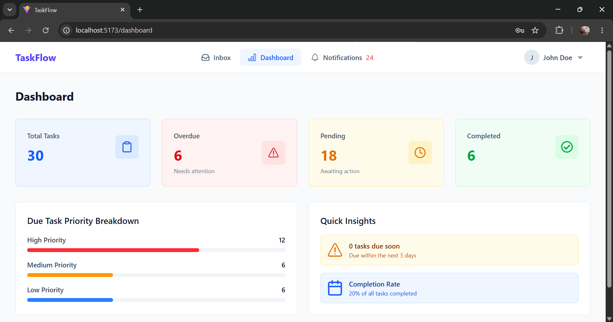
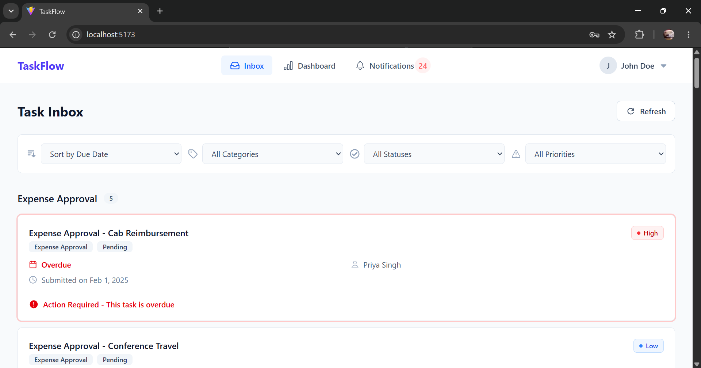
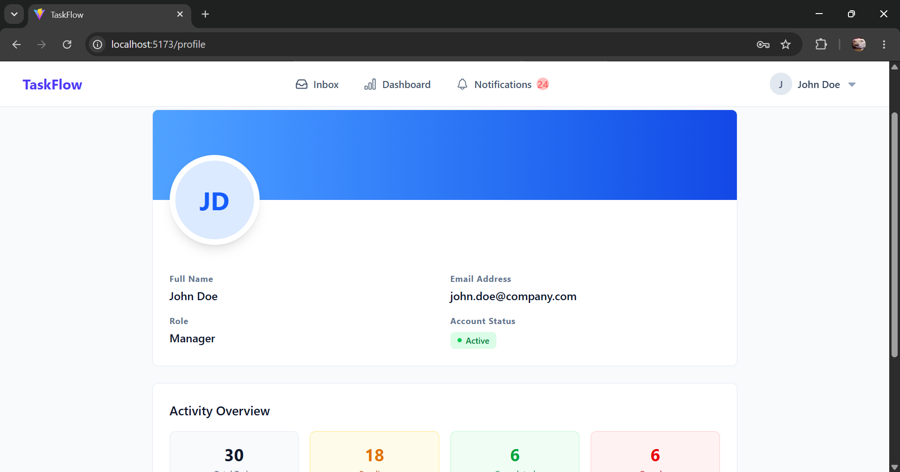
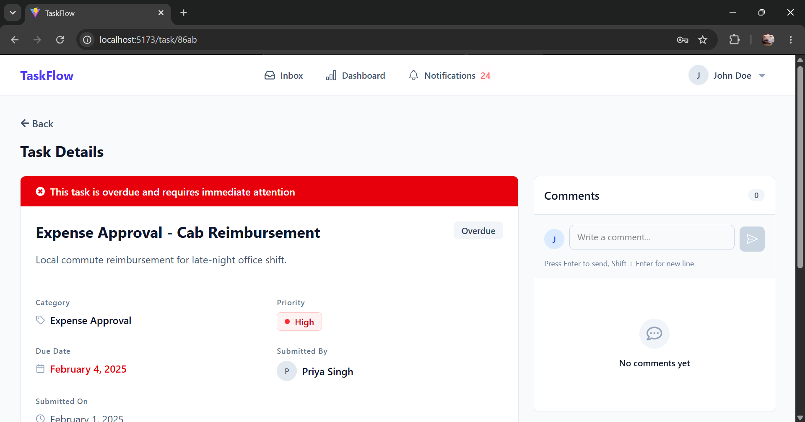
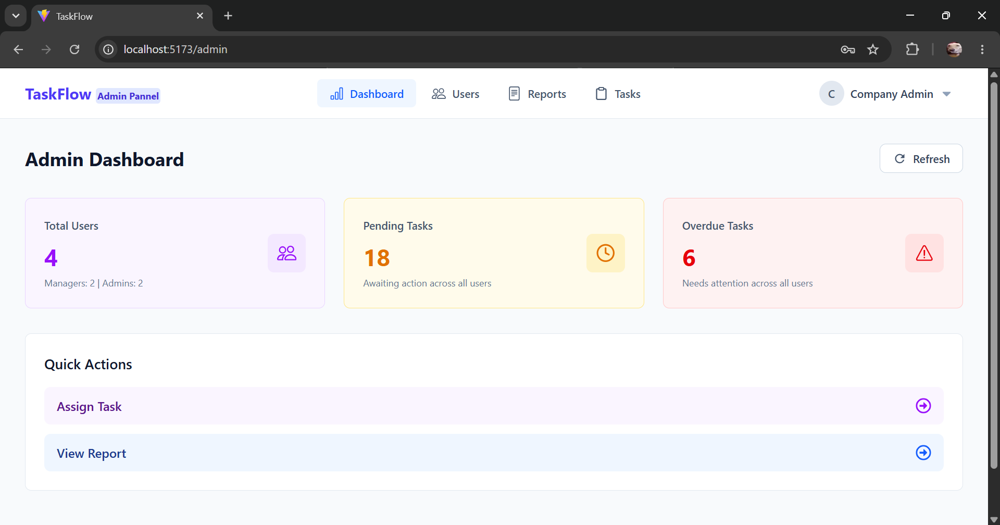
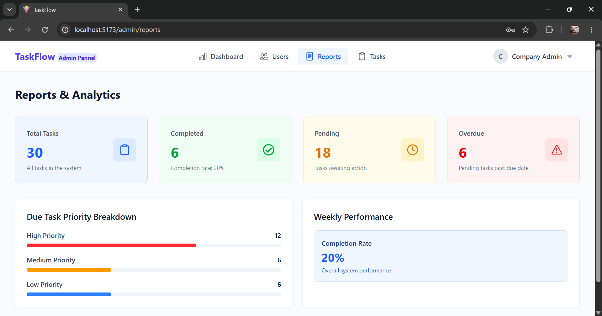
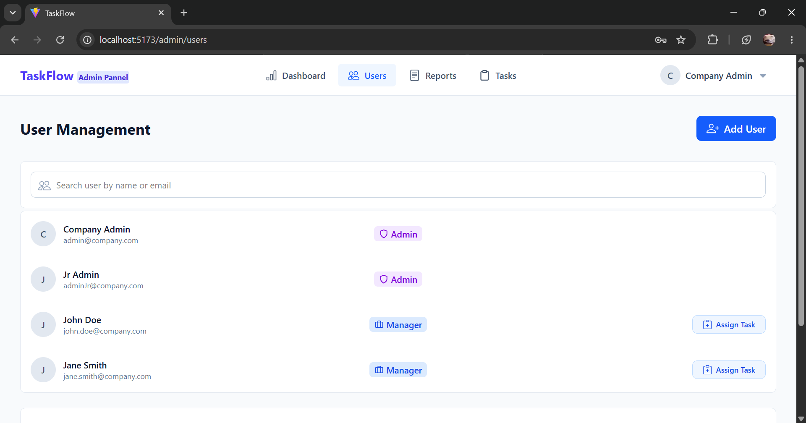
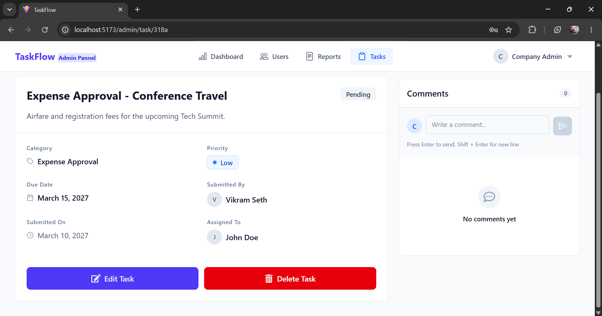

# TaskFlow – Approval & Task Management System

A React-based web application built to streamline how managers receive, review, and act on requests. Features a dedicated admin panel for assigning tasks, managing users, editing tasks, and monitoring overall stats, with a role-based access control to separate manager and admin workflows.

## Features

* 📥 Task inbox with filtering and sorting
* 📋 Detailed task view with context-aware action buttons and dynamic routing
* ✅ Manage tasks with optional comments
* 🔔 Smart notifications with live unread count for new assignments, deadlines, and overdue items
* 📊 Dashboard summary showing pending, completed, overdue, and due-soon tasks with priority breakdowns
* 🛡️ Admin panel for assigning tasks, editing tasks, managing users, and viewing overall system report
* 👥 User management with the ability to add new users
* ✏️ Task editing with dynamic additional-detail fields
* 🔐 Role-based access control with protected routes for manager and admin roles
* 💾 Session persistence via local or session storage with "Keep me signed in" option

## Screenshots

<details>
<summary>Click to view sample screenshots</summary>

### Manager Dashboard



### Inbox



### Manager Profile



### Manager Task View



### Admin Dashboard



### Admin Report



### User Management



### Admin Task View


</details>

## Tech Stack

* **React (JavaScript)** – Component-based UI development
* **Vite** – Lightning-fast development server & bundler
* **React Router DOM** – Client-side routing
* **Tailwind CSS** – Utility-first styling
* **JSON Server** – Local mock backend & REST API
* **React Toastify** – Toast notifications for user feedback
* **React Icons** – Icon library

## Installation

### Prerequisites

Make sure you have completed the [Vite – Environment Setup](https://vite.dev/guide/) instructions.

### Step 1: Clone the Repository

```bash
git clone https://github.com/Hardik0602/TaskFlow
cd TaskFlow
```

### Step 2: Install Dependencies

```bash
npm install
```

### Step 3: Environment Variables

Create a `.env` file in the root directory and configure the API URL (defaults to localhost):

```env
VITE_API_URL=http://LocalIP:3000
```

### Step 4: Start the Local Backend

```bash
npm run server
```

### Step 5: Start the Development Server

```bash
npm run dev
```

## Dependencies

```json
{
  "@tailwindcss/vite": "^4.1.18",
  "json-server": "^1.0.0-beta.5",
  "react": "^19.2.0",
  "react-dom": "^19.2.0",
  "react-icons": "^5.5.0",
  "react-router-dom": "^7.13.0",
  "react-toastify": "^11.0.5",
  "tailwindcss": "^4.1.18"
}
```
## Project Structure

```
TaskFlow/
├── src/
│   ├── components/          # Reusable UI components
│   │   ├── ActionConfirmModal.jsx
│   │   ├── AdminNavBar.jsx
│   │   ├── Comments.jsx
│   │   ├── NavBar.jsx
│   │   ├── Stats.jsx
│   │   ├── TaskCard.jsx
│   │   └── UserList.jsx
│   ├── context/             # React Context providers
│   │   ├── AuthContext.jsx      # Authentication & login/logout
│   │   ├── DataContext.jsx      # Derived data, filtering, sorting
│   │   └── TaskContext.jsx      # Task CRUD, notifications, read state
│   ├── helper/              # Utility components
│   │   ├── Notification.jsx     # Notification generation
│   │   ├── ProtectedRoute.jsx   # Auth guard
│   │   └── RoleProtectedRoute.jsx # Role guard
│   ├── layouts/             # Layout wrappers
│   │   ├── AdminLayout.jsx
│   │   └── MainLayout.jsx
│   ├── pages/
│   │   ├── Login.jsx
│   │   ├── admin/               # Admin-only pages
│   │   │   ├── AddUser.jsx
│   │   │   ├── AdminDashboard.jsx
│   │   │   ├── AdminProfile.jsx
│   │   │   ├── EditTask.jsx
│   │   │   ├── Reports.jsx
│   │   │   ├── TaskAssign.jsx
│   │   │   ├── Tasks.jsx
│   │   │   └── UserManagement.jsx
│   │   └── manager/             # Manager-only pages
│   │       ├── Dashboard.jsx
│   │       ├── Inbox.jsx
│   │       ├── Notifications.jsx
│   │       ├── Profile.jsx
│   │       └── TaskDetail.jsx   # Also used by admin; has admin-only actions
│   ├── App.jsx              # Router configuration
│   ├── config.js            # Environment config
│   ├── index.css
│   └── main.jsx             
├── .env                     # Environment variables
└── db.json                  # Mock database
```

## Key Features Implementation

### Authentication

* Session persistence using local or session storage (based on "Keep me signed in")
* Protected routes redirecting unauthenticated users to `/login`
* Role-based route protection
* Log out with full session clearance

### Task Inbox (Manager)

* Filter by category, status, and priority
* Sort by due date or priority
* Tasks grouped by category with smart status ordering (overdue → pending → in progress → completed)
* Overdue tasks automatically flagged and elevated to high priority

### Task Detail & Actions

* Dynamic routes using task IDs (`/task/:id` and `/admin/task/:id`)
* Confirmation modal before submitting any action
* Comments section with per-task comment history

### Notifications (Manager)

* Notification bell with live unread count in the navigation bar
* Auto-generated notifications for new assignments, approaching deadlines, and overdue tasks
* Mark individual or all notifications as read

### Admin Panel

* **Dashboard** - Summary cards for total tasks, pending, completed, and overdue counts across all managers
* **User Management** - Browse, search, and add new users
* **Task Assignment** - Assign new tasks to managers with custom detail fields
* **Task Editing** - Edit description, priority, assignee, due date, and additional details of existing tasks
* **Reports** - System-wide stats and priority breakdowns
* **Task Browser** - View and filter all tasks system-wide

### UI / UX

* Mobile-first responsive design using Tailwind CSS
* Modular and reusable component structure
* Loading spinners for async operations
* Toast notifications for real-time user feedback
* Clean and modern layout for improved usability
* Smooth animations for page transitions

## Demo Credentials

| Role | Email | Password |
|---|---|---|
| Manager | `john.doe@company.com` | `password123` |
| Manager | `jane.smith@company.com` | `password123` |
| Admin | `admin@company.com` | `password123` |
| Admin | `adminJr@company.com` | `password123` |